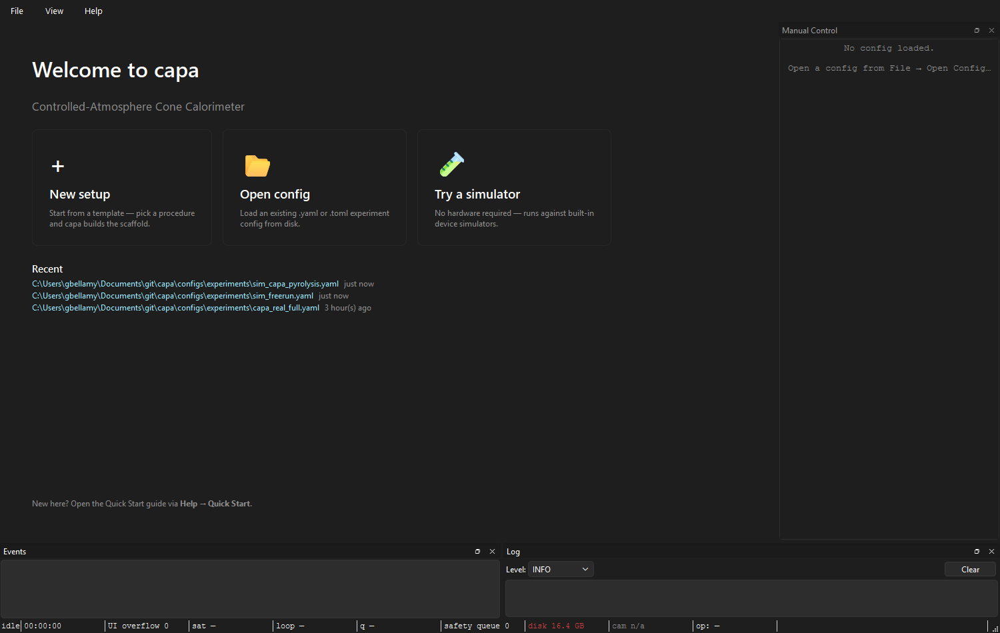
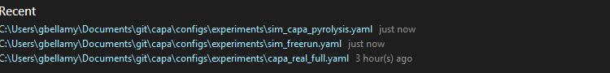

# Daily operator workflow

**Audience:** operators running a sequence of experiments in one session
— typically four to ten runs in a morning or afternoon.
**Scope:** the cadence between runs. Loading, editing, applying,
running, sealing, re-arming without restarting the app.

This page assumes you've already worked through
[your first real run](first-real-run.md) once. It picks up at the
end-of-day → next-morning hand-off.

---

## Picking up where someone left off

Launch capa. The welcome screen's **Recent** list shows configs that
have been opened recently:

Click the top entry to load yesterday's config. The Setup tab opens
with the saved values; the [connection strip](../user-guide/the-setup-tab.md#connection-strip)
reads:

> ◐ Config loaded — Apply & Connect to open hardware.

Hardware is not yet open — capa never auto-connects on launch. Click
**Apply && Connect** and the strip cycles CONNECTING → CONNECTED.
You're ready to run.

---

## Editing between runs

The standard between-runs edit is the new sample id and any
sample-specific notes:

1. **Experiment → Operator & sample.** Update the sample id.
2. **Experiment → CAPA Profile.** Update specimen mass (post-tare) and
   anything else that's per-sample.
3. The connection strip flips to ◐ **Draft has *N* unsaved edit(s).**
4. Click **Apply && Connect**. Strip cycles CONNECTING → CONNECTED.

That's the loop. Five clicks, fifteen seconds.

For setpoint changes you want *during* a run, don't use Apply — use the
[manual control dock](../user-guide/manual-controls.md). Apply is
refused mid-run anyway: the strip reads:

> 🔒 Run in progress — config locked until the run completes.

---

## What Apply & Connect actually does

Every Apply & Connect:

1. Validates the composed draft (Setup + Method buffers).
2. Closes the previous worker pool.
3. Builds a fresh worker pool from the new config.
4. Opens every device the new config declares — serial ports,
   network sockets, NI-DAQ tasks, camera handles.
5. Publishes `pool_changed` so the [manual control dock](../user-guide/manual-controls.md)
   rebuilds its cards.

This is one path, not two. There is no "hot" vs "cold" mode toggle. The
practical speed difference is:

- **Same hardware list, parameter-only edit:** the close-then-reopen
  cycle takes a second or two because every port is closed and
  reopened. There's no shortcut today.
- **Different hardware list (new device added, one removed):** same
  close-then-reopen plus any cost from the new device's open path
  (NI-DAQ chassis enumeration is the slowest).

Future versions may avoid the pool rebuild for parameter-only changes;
that's not in today's runtime.

---

## What you don't need to redo

Within one session, after the first successful Apply:

- **Hardware discovery.** Once the device table matches the rig, you
  don't need to re-scan unless wiring changes.
- **Calibration import.** The calibration snapshot persists across
  Apply cycles. It re-snapshots on each Apply, but you don't have to
  re-pick the source set.
- **Operator id.** Stays in the field until you change it. Change it
  when *you* change.
- **Procedure / profile choice.** Sticky across Apply cycles. Change
  only when switching experiment types.

What *does* change on every run: the sample id, the bundle output
directory (one per run), the elapsed timer.

---

## Reading the recents list

`~/.capa/recents.json` holds up to 10 entries, most-recent first.
Duplicate paths are deduped (re-opening the same config bumps it to
the top instead of growing the list). Paths whose files have been
deleted are filtered out at read time — the file isn't eagerly cleaned.

If the recents list shows a path that no longer exists on disk, it'll
silently disappear the next time you open something — no action
required.

The **Open ▾ → Recent** submenu in the Setup tab toolbar is the same
list.

---

## Reviewing during the day

The status bar's `bundle:` pill always points at the most-recently
sealed bundle. To inspect it:

- **Help → Open logs folder** opens the runs root in your OS file
  browser.
- For a queryable view across the day's runs, use the
  [capa catalog CLI](../cli/capa-catalog.md) — it reads the
  `capa.catalog.sqlite` index that every Apply / run writes into.

There's no in-app sealed-bundle browser. See
[reviewing a run](../user-guide/reviewing-a-run.md) for the external
tools.

---

## Wrapping up at end of day

When you're done:

1. Make sure the last run sealed (`Sealed` badge, `(completed)` or
   `(aborted)` on the run-id line).
2. **Close capa** (window close, or `Ctrl+Q`). The
   `ShutdownCoordinator` cleanly closes the worker pool — serial ports
   are released, NI-DAQ tasks ended, camera handles closed. No data is
   lost; the last run was already sealed before you got here.
3. **Power down or leave running** per your lab's policy. capa doesn't
   care either way; the next launch picks up from the recents list.

If you killed the process (Task Manager / `kill -9`) instead of closing
cleanly, see [crash recovery](../troubleshooting/crash-recovery.md) —
the next launch's finalize-on-startup pass picks up any bundle stuck in
`finalizing` state.

---

*See also:* [Your first real run](first-real-run.md),
[The Setup tab](../user-guide/the-setup-tab.md),
[Manual controls](../user-guide/manual-controls.md) for between-runs
device commands,
[Reviewing a run](../user-guide/reviewing-a-run.md).
