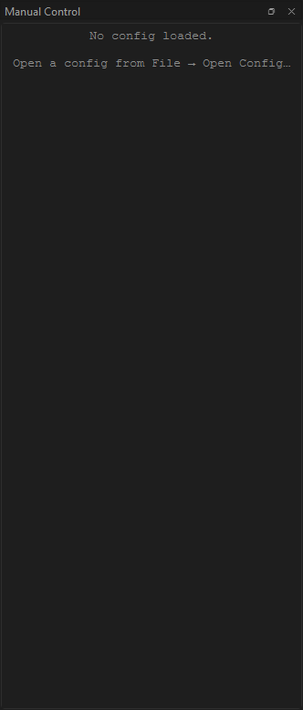
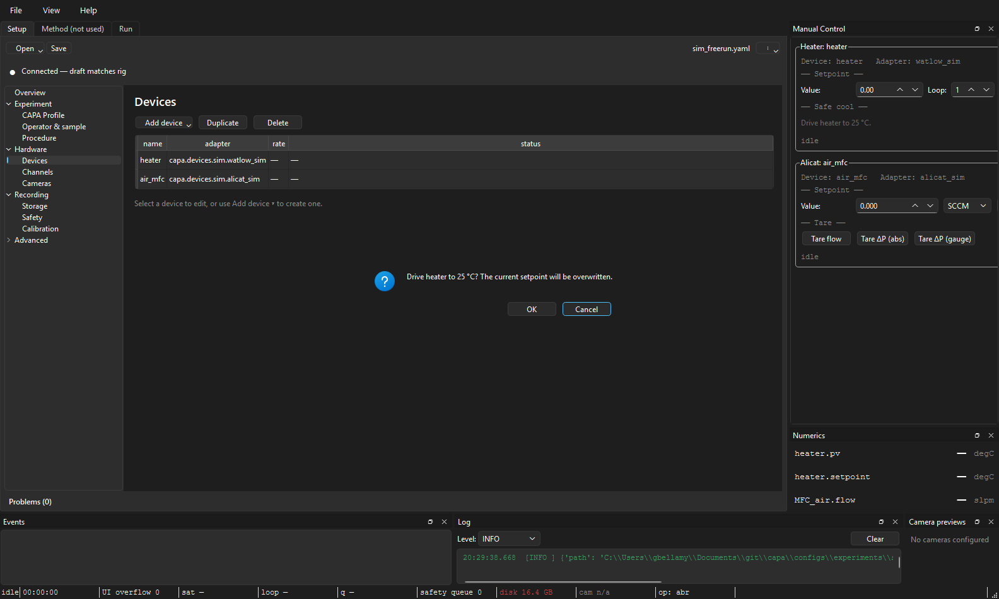

# Manual controls

**Audience:** operators issuing one-off commands — taring a balance,
setting a heater between runs, picking a webcam resolution.
**Scope:** the Manual Control dock, the per-device cards inside it, how
commands route to the right place at the right time, and the
confirmation dialog that protects destructive operations.

---

## Anatomy

The dock is one vertically-stacked, scrollable list of cards. One card
per device that advertises any manual-relevant capability.


```
┌─ Manual Control ─────────────────────────────────────────────────┐
│                                                                  │
│  ┌─ Balance: balance_main ────────────────────────────────────┐  │
│  │  Last cal: 2026-04-22 14:30 OK                             │  │
│  │  [Tare]   [Zero]   [Internal cal…]   [Save settings…]      │  │
│  │  Filter: [stable    ▾]   Auto-zero: [on ▾]                 │  │
│  └────────────────────────────────────────────────────────────┘  │
│                                                                  │
│  ┌─ Heater: heater_01 ────────────────────────────────────────┐  │
│  │  PV: 24.6 °C    SP: 25.0 °C                                │  │
│  │  Setpoint: [   25.0  ] °C   [Apply]                        │  │
│  │  [Heat-flux tune…]                                         │  │
│  └────────────────────────────────────────────────────────────┘  │
│                                                                  │
│  ┌─ MFC: mfc_n2 ──────────────────────────────────────────────┐  │
│  │  Flow: 0.0 sccm   Setpoint: 0.0 sccm                       │  │
│  │  Setpoint: [   0.0   ] sccm   [Apply]                      │  │
│  │  Gas: [N2 ▾]   [Valve hold]   [Reset totalizer…]           │  │
│  └────────────────────────────────────────────────────────────┘  │
│                                                                  │
└──────────────────────────────────────────────────────────────────┘
```

The dock can be torn off and re-docked on any edge of the main window.

When no config is loaded:



When a config has loaded but no device advertises a manual-control
capability:

```
No devices with manual controls in this config.
```

---

## How cards appear and disappear

The dock rebuilds on every config-load. Cards are gated *reflectively*
on each adapter's `Capability` flagset. If a device advertises **none**
of the manual-relevant capabilities (`HAS_TARE`, `HAS_ZERO`,
`HAS_INTERNAL_CAL`, `HAS_PARAMETER_CONFIG`, `HAS_SETPOINT`,
`HAS_GAS_SELECT`, `HAS_VALVE_HOLD`, `HAS_TOTALIZER`,
`HAS_DISPLAY_CONTROL`), the device is skipped entirely — no empty card.

If the worker pool is still **opening** when the dock builds, the cards
fall back to the adapter-import-string fingerprint (e.g. *sartorius* →
balance, *alicat* → MFC) to pick the right card class. They'll repick
the right capability set once the pool finishes opening.

The five card classes that ship today:

| Card | Devices it matches | Common controls |
|---|---|---|
| **HeaterCard** | Watlow temperature controllers | Setpoint, Heat-flux tune launcher |
| **BalanceCard** | Sartorius balances | Tare, zero, internal cal, filter / auto-zero / display unit, save settings |
| **AlicatCard** | Alicat MFCs and pressure devices | Flow setpoint, gas select, valve hold, totalizer reset |
| **FlirCard** | FLIR IR cameras | Stream format, palette, NUC trigger |
| **WebcamCard** | USB / built-in cameras | Resolution, framerate, codec |

---

## Routing: where does my command actually go?

Cards never dispatch directly. They go through `ManualClient`, which
routes one of two ways depending on the current [run state](the-run-tab.md):

| When | Routes to | Recorded in bundle? |
|---|---|---|
| `IDLE` / `SEALED` / `FAILED` (no run, or run finished) | **WorkerPool** | No — there is no run. The dispatch shows up in the events dock as a "manual_event" for audit. |
| `RUNNING` | **Conductor** | Yes — the command is recorded as an event in `events.sqlite`. The operator id is stamped onto it. |
| `PREPARING`, `DRAINING`, `FINALIZING` *(write-blocked states)* | **Refused** | Card disables its buttons. |

During a run, the cards show their write-blocked state inline:


The write-blocked states exist because the conductor doesn't own the
workers cleanly during them — `PREPARING` is opening, `DRAINING` is
disarming, `FINALIZING` has already handed the bundle to the sealer.
Trying to dispatch a manual command in those windows would race the
state machine.

If you need to change a setpoint mid-run, the right place is *during*
`RUNNING`. The card will accept it, the conductor will route it, and
the change is captured in the bundle alongside the sample data.

---

## Confirmation for destructive operations

Some manual commands physically change the device's stored state in a
way that can't be undone by a power cycle. These show a
**confirmation dialog** before dispatching:

- **Balance:** Internal cal, Save settings (writes EEPROM), Reload from EEPROM.
- **Heater:** Save parameters (writes EEPROM).
- **Alicat:** Save calibration (when chosen), Reset totalizer peak-flow watermarks.

The dialog spells out exactly what's about to happen — for example:

> Confirm destructive operation:
>
>   Trigger internal calibration on balance_main. Requires ~30 s; the
>   balance refuses other commands during the cal cycle.
>
> Proceed?

This is a standard modal `QMessageBox` — click Yes / No, not hold-to-
confirm. (The 1-second hold-to-confirm pattern is used only for the
Emergency stop button on the [Run tab](the-run-tab.md#emergency-stop),
where the cost of a misclick is much higher.)

Non-destructive commands (Tare, Zero, setpoint changes, gas select)
dispatch immediately on click.

A confirmation in flight:



---

## Read-back values

Each card shows the device's current state above its controls — a heater
card shows `PV` and `SP`, a balance shows `Last cal: …`, an MFC shows
the live flow. These refresh:

- **Once on card open**, asynchronously (scheduled when the pool
  reports ready).
- **After each successful command**, so a Tare immediately repaints the
  reading.

If the read-back fails (typically because the pool is mid-rebuild after
a cold reload), the card logs at debug level and leaves the previous
value visible. No banner; the next refresh attempt catches up.

---

## Jumping to a card from the Setup tab

In the [Setup tab](the-setup-tab.md#hardware-devices)'s Devices
section, right-click a row → **Open manual control**. The main window
switches to the Run tab, shows the manual dock if it was hidden, and
scrolls the named device's card into view (centred in the viewport).

Convenient when you're triaging a device that's misbehaving and don't
want to scrub through a long manual-dock scroll.

---

*See also:* [The Run tab](the-run-tab.md) for write-blocked-state
gating, [The Setup tab](the-setup-tab.md) for the Devices section that
jumps here, [Authorization gates](../safety/authorization-gates.md) and
[Destructive operations](../safety/destructive-operations.md) for the
safety contract behind the confirmation dialog.
