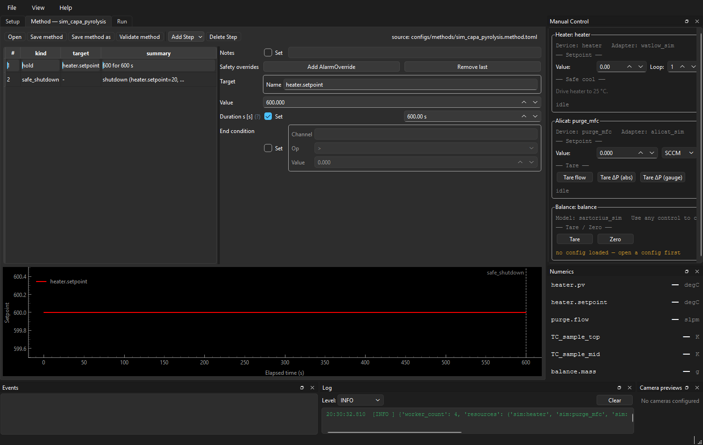
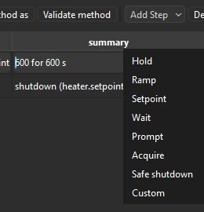
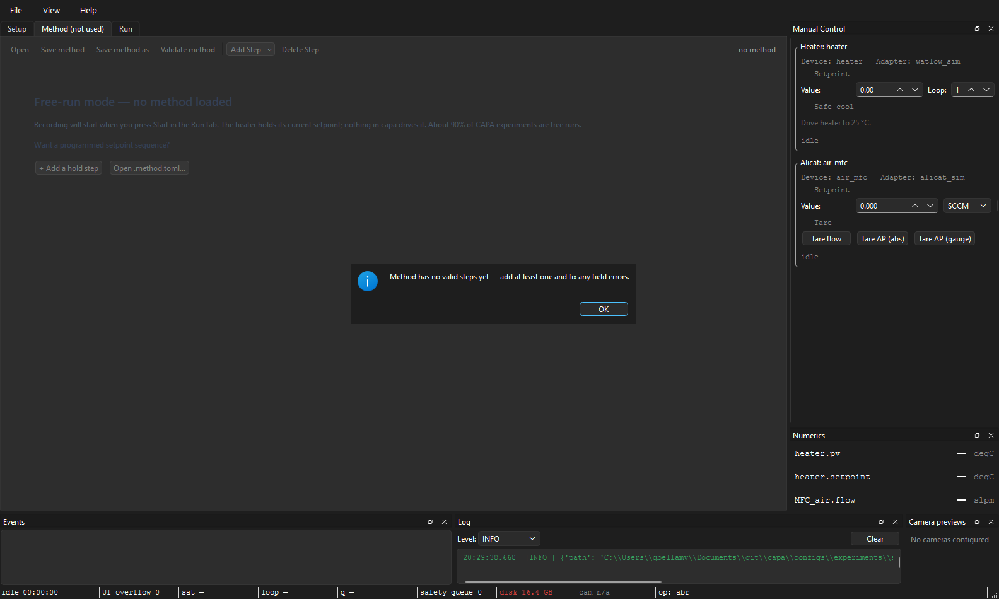

# The Method tab

**Audience:** operators authoring or editing methods.
**Scope:** how the Method tab edits a `.method.toml` file — the toolbar,
the step table, the per-step detail form, the profile graph, save and
validate semantics.

> **Most CAPA runs don't use a method.** About 90% of CAPA experiments
> hold a single setpoint and never leave it. The Method tab is empty in
> those — that's *free-run mode* and it's the intended default. Read on
> only if you're scripting a ramp, multi-step program, or hand-off to a
> custom procedure.

For the on-disk schema and field reference, see
[Method TOML](../configuration/method-toml.md). For what each step
*does* at run time (timing, conditions, fault behaviour), see
[Method steps reference](../procedures/method-steps-reference.md).
**This page is the GUI only.**

---

## Anatomy

```
┌──────────────────────────────────────────────────────────────────────┐
│ Open  Save  Save As  Validate │  [+ Add Step ▾]  Delete Step         │  ← toolbar
│                                              source: configs/…       │
├──────────────────────────────────────────────────────────────────────┤
│  ┌─────────────────────┬──────────────────────────────────────────┐  │
│  │ # │ kind  │ summary │  Step detail (auto-form)                 │  │  ← step table
│  │ 1 │ Hold  │ heater… │  target.name:  heater.setpoint           │  │     + detail
│  │ 2 │ Ramp  │ heater… │  value:        25.0  °C                  │  │
│  │ 3 │ Safe… │ cool to │  duration_s:   60                        │  │
│  │   │       │         │  end_condition: (none)                   │  │
│  └─────────────────────┴──────────────────────────────────────────┘  │
│  ┌────────────────────────────────────────────────────────────────┐  │
│  │ setpoint (°C)                                                  │  │
│  │  100 ┤                  ╱──────                                │  │  ← profile graph
│  │   75 ┤              ╱                                          │  │
│  │   50 ┤          ╱                                              │  │
│  │   25 ┤──────╱            ╲────                                 │  │
│  │      └────────────────────────────► elapsed (s)                │  │
│  └────────────────────────────────────────────────────────────────┘  │
└──────────────────────────────────────────────────────────────────────┘
```

When the method has zero steps, the table/detail/graph stack is replaced
with a **free-run-mode** placeholder explaining what will happen if you
hit Start with no method loaded, and offering one-click shortcuts to
**+ Add a hold step** or **Open .method.toml…**.


A loaded multi-step method shows the table, detail form, and profile
graph in one stack:



---

## Toolbar

| Action | What it does |
|---|---|
| **Open** | File picker (`*.toml`). Validates and loads, or shows the parse / validation error in a modal. |
| **Save** | Write back to the source path. Validates first; refuses to write if the method is incomplete (see [Save & Validate](#save-and-validate)). |
| **Save As** | Pick a new path; appends `.toml` if missing. |
| **Validate** | Surface the step count or the first failing field, without writing. |
| **+ Add Step ▾** | Submenu listing the eight step kinds (below). |
| **Delete Step** | Remove the selected row. |

The right-aligned **source** label shows where the current method came
from: a file path, `"<name> (unsaved)"` for new methods, or `"no method"`
when empty.

---

## Step kinds

The Add Step menu offers eight kinds:




| Kind | Purpose | Minimum fields the form requires |
|---|---|---|
| **Hold** | Command a setpoint and wait. | `target.name`, `value`, **one of** `duration_s` or `end_condition` |
| **Ramp** | Linearly walk a setpoint from current value to `end_value`. | `target.name`, `end_value`, **one of** `rate_per_second` or `duration_s` |
| **Setpoint** | Command a setpoint, no wait. | `target.name`, `value` |
| **Wait** | Idle / wait for a condition (no control changes). | **one of** `duration_s` or `end_condition` |
| **Prompt** | Pause until the operator clicks the prompt dialog. | `message` |
| **Acquire** | Record without commanding anything; useful for "just sit and capture data for *N* seconds." | `duration_s` |
| **Safe shutdown** | Drive named channels to safe values (cooldown). Also invoked by the safety system on faults. | `cool_target` (`{channel_name: setpoint}` dict) |
| **Custom** | Hand control to a plugin-registered handler. | `handler_id` |

Each Add inserts a row *after* the current selection with sane defaults
(e.g. Hold = `heater.setpoint`, 25 °C, 60 s). Defaults are deliberately
tame — a hold at 25 °C for 60 s won't damage a real reactor if the
operator forgets to edit it.

The new row is selected immediately so the detail panel surfaces its
form for editing.

---

## Step detail (auto-form)

The right pane is a Pydantic-driven auto-form for the selected step.
Every field is unit-aware where applicable (the spinbox suffix is the
expected unit; the form converts on edit). The form's `kind` field is
hidden because the row's kind is fixed at insertion — change kind by
deleting and re-adding.

Edits flow back into the step table immediately. If the edit makes the
step invalid (e.g. a Hold with neither `duration_s` nor `end_condition`),
the offending field gets an inline marker; the previous valid row stays
in the model until you fix the field. **The graph and table never show a
half-valid step.**

---

## Profile graph

The lower pane plots commanded setpoint vs. elapsed time. It refreshes
on every edit, so dragging a Ramp's `duration_s` from 60 to 600 visibly
flattens the slope.

What the graph **doesn't** show:

- Process values (PVs). The graph is a *commanded-setpoint* preview, not
  a simulation. Whether the heater can actually reach 1000 °C in your
  ramp time depends on the rig, not the method.
- End-condition steps. A Hold whose `end_condition` triggers on mass
  loss is plotted as a single horizontal segment at the commanded value
  with no duration estimate — there's no way to know how long it will
  hold in advance.

---

## Save and Validate

**Save validates before writing.** A method must satisfy the
`Method` Pydantic model (`min_length=1` on `steps`, plus per-step
validators). If validation fails, Save shows a modal with the error
list and **does not write the file**. The next Save retry runs the same
validation.



Validators that catch the common foot-guns:

- **Hold:** at least one of `duration_s` or `end_condition`.
- **Ramp:** at least one of `rate_per_second` or `duration_s` (you can
  set both, but at least one is required).
- **Wait:** at least one of `duration_s` or `end_condition`.

Standalone **Validate** (toolbar button) does the same check without
writing — useful before clicking Apply & Connect on the Setup tab,
where the Method tab's in-memory buffer is composed with the experiment
config.

---

## How the Method tab and the Setup tab talk

The Method tab does not reach into the run controller. Instead:

- On successful Save, the tab emits `methodSaved(path)`.
- The main window's `DocumentCoordinator` mirrors the new path into the
  Setup draft's `method:` reference. The Setup tab's connection strip
  flips from CONNECTED → UNAPPLIED if the change isn't yet on the rig.
- On Setup-tab Apply & Connect, the live method buffer (whatever the
  Method tab currently has, even if unsaved) is composed with the
  Setup config and pushed to the conductor. This is what makes "edit a
  setpoint, click Apply, click Start" work without saving in between.

When an experiment with no `method:` reference is loaded, the Method tab
is cleared and switches to the free-run placeholder pane — the displayed
state always agrees with the loaded experiment, even if it means dropping
in-progress edits.

---

*See also:* [Method TOML](../configuration/method-toml.md),
[Method steps reference](../procedures/method-steps-reference.md),
[The Setup tab](the-setup-tab.md),
[Aborting safely](aborting-safely.md) — for what Safe shutdown does
beyond an explicit method step.
