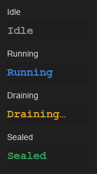
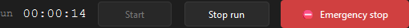

# The Run tab

**Audience:** operators during an active run.
**Scope:** the live-run console — state badge, Start / Stop / Emergency
buttons, plot pane. Sibling docks (numerics, events, log, manual
control) are documented separately.

The Run tab is small on purpose. It owns the one-line answer to *what is
the rig doing right now?* and the three buttons that change it. Live
data lives in the plot pane in the centre; numbers, events, and the
operator-control surface live in docks around it.

---

## Anatomy

```
┌──────────────────────────────────────────────────────────────────────┐
│  Running    sample: A12  ·  procedure: free_run  ·  Free run         │
│  00:01:42                                  [Start] [Stop run] [⛔ Emergency]
├──────────────────────────────────────────────────────────────────────┤
│                                                                      │
│                    Plot pane (PyQtGraph)                             │
│                                                                      │
│     One subplot per channel group, time on the x-axis,               │
│     channel-specific units on the y-axis.                            │
│                                                                      │
│                                                                      │
└──────────────────────────────────────────────────────────────────────┘
```


The header carries:

- The **state badge** (left): a monospace, bold word in a colour that
  matches the lifecycle.
- The **run identity** line: `sample: <id>  ·  procedure: <id>  ·  Mode`.
  Mode is either `Free run` (no method loaded) or `Method: <name>`. This
  is the same triplet the prior status strip carried — now folded into
  the header so the Run tab has one "what's loaded" surface above the
  plot.
- The **elapsed timer**: monotonic seconds since Start, refreshing once
  per second. Wall-clock drift never affects it.
- The three control buttons (right): Start, Stop run, Emergency stop.

---

## The state badge

The badge cycles through seven values. Each maps to a colour from the
shared palette ([theme.py](https://github.com/GraysonBellamy/capa/blob/main/src/capa/ui/theme.py)):

| State | Display string | Colour | Meaning |
|---|---|---|---|
| `IDLE` | `Idle` | gray | No conductor. Pool may be open (between runs) or closed (no config loaded yet). |
| `PREPARING` | `Preparing…` | warn | Conductor is opening the session and arming workers. |
| `RUNNING` | `Running` | running (green) | Procedure is running; samples flowing. |
| `DRAINING` | `Draining…` | warn | Procedure ended (naturally or by abort); workers disarming. Manual writes refused. |
| `FINALIZING` | `Finalizing…` | warn | Bundle is being rewritten and sealed. |
| `SEALED` | `Sealed` | ok (green) | Bundle finalized cleanly. Previous run's result is inspectable. |
| `FAILED` | `Failed` | fail (red) | Bundle finalize itself failed, **or** the run never reached SAMPLING (preflight refusal, pool-open failure). |

Four of these — `PREPARING`, `RUNNING`, `DRAINING`, `FINALIZING` — are
**write-blocked states**: the [manual control dock](manual-controls.md)
refuses commands during them because the conductor owns the workers.

The four canonical colours, side-by-side:



After a run finishes, the badge stays on `SEALED` (or `FAILED`) until
the next Start brings it back to `PREPARING`. There is no automatic
reset to `IDLE`.

Mid-run, the badge is green and both abort buttons are armed:


After Stop, the badge moves to `Sealed`, the run-id line picks up the
final `run_status`, and the events dock prints the sealed bundle path:


---

## The three buttons



### Start

Begins a new run with the currently-loaded config.

**Enabled when all of:**

- A config is loaded.
- No run is already active (`controller.is_active` is `False`).
- The worker pool is open (`PoolState.OPEN`).
- Hardware is ready (`hardware_ready` flag from the controller).

If you click Apply & Connect and the Start button stays grey, the most
likely cause is that the pool is still **OPENING** — which would crash
the conductor's preparation with `PoolStateError`. Watch the
[connection strip](the-setup-tab.md#connection-strip) on the Setup tab
flip CONNECTING → CONNECTED, then Start will light up.

On click, Start does **not** open hardware — that happened at Apply &
Connect. It rebuilds the channel ring buffers, swaps in a fresh plot
pane, hands control to the conductor, and disables itself while the
run is in flight.

### Stop run

Single click. Requests a graceful abort —
`controller.request_abort(mode="safe_shutdown")`. The conductor runs the
method's `SafeShutdownStep` (or a sensible cooldown for free runs),
disarms workers, finalizes the bundle.

Always available during `RUNNING`. See
[aborting safely](aborting-safely.md) for the full behaviour.

### Emergency stop

`⛔ Emergency stop` is a **hold-to-confirm** button — press and hold for
1 second; a progress bar fills the button while you hold. Release early
and nothing happens.

The hold gate is intentional. A misclick on a one-hour run would lose
the run; a misclick on an eight-hour overnight run is much worse. One
second is short enough to feel responsive in a real emergency and long
enough to abort a misclick.

On confirm, calls `controller.request_abort(mode="immediate")`. See
[aborting safely](aborting-safely.md) for what `immediate` actually
does — the abort modes differ in their recorded reason and the
guarantees about cooldown timing.

Both Stop and Emergency seal the bundle. Neither loses recorded data.

---

## The plot pane

A `PlotPane` subplot stack rebuilt twice per run:

1. **On config-load** (Apply & Connect): an empty pane is built against
   a placeholder registry so axes and legends are visible before Start.
   You see "the plot is wired" without any line data.
2. **On the IDLE → RUNNING transition**: the pane is rebound to the
   actual ring-buffer registry the conductor populated. Lines start
   appearing within one buffer-flush interval (default ~50 ms).

When the run finishes, the pane is **stopped** — it keeps showing the
final data but no longer pulls new samples. The next Start tears it
down and rebuilds.

Decimation, time windows, and channel grouping are configured per
channel in the experiment YAML. See
[channel bindings](../configuration/channel-bindings.md) for the knobs.

---

## What you should watch during a run

The Run tab itself does not show distress signals. The [status bar at
the bottom of the window](status-bar-guide.md) does — and `sat`, `loop`,
`q`, and `disk` are the four pills worth glancing at every few minutes.

A healthy steady state for a simulator run looks like:

```
RUNNING  00:00:42  UI overflow 0  sat ok  loop 8 ms  q 1/47  disk 87% free
```

If any of those flip yellow or red, see
[status bar guide](status-bar-guide.md#quick-reference-which-pill-points-where)
for what to check.

---

## When the run ends

The badge moves to `SEALED` (clean exit, even after an abort) or
`FAILED` (preflight refused, or finalize itself crashed). The run-id
line is replaced with:

- `run: <run_id>  (<run_status>)` — on a sealed bundle. `run_status` is
  one of `completed`, `aborted`, or `crashed`.
- `run refused: <reason>` — when no bundle was produced (typically
  preflight refused before opening anything).

The bundle's full path is also stamped into the status bar's `bundle:`
pill. From there see [reviewing a run](reviewing-a-run.md).

The Start button comes back enabled one event-loop tick after the run
finishes (the underlying task needs a tick to mark itself `done()`),
so a quick click immediately after `SEALED` may briefly look ignored —
wait half a second.

---

*See also:* [Status bar guide](status-bar-guide.md),
[Aborting safely](aborting-safely.md),
[Manual controls](manual-controls.md),
[Reviewing a run](reviewing-a-run.md),
[Runtime architecture](../architecture/runtime-architecture.md).
