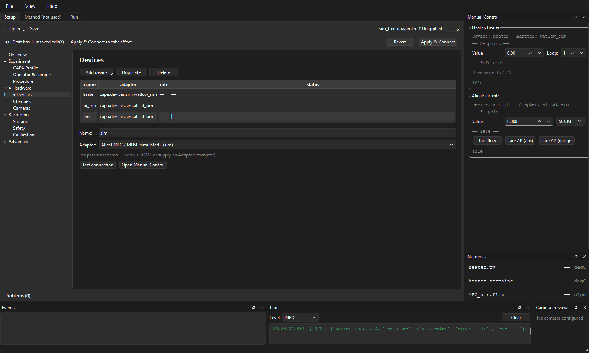
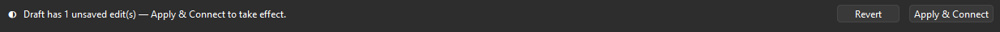
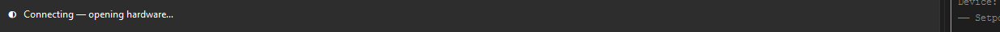
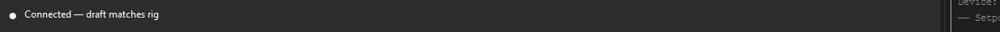
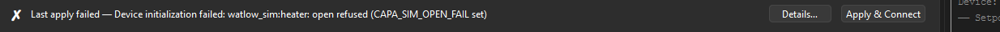
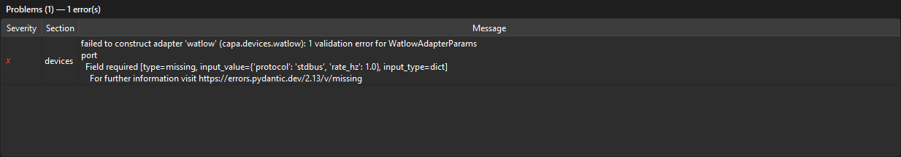
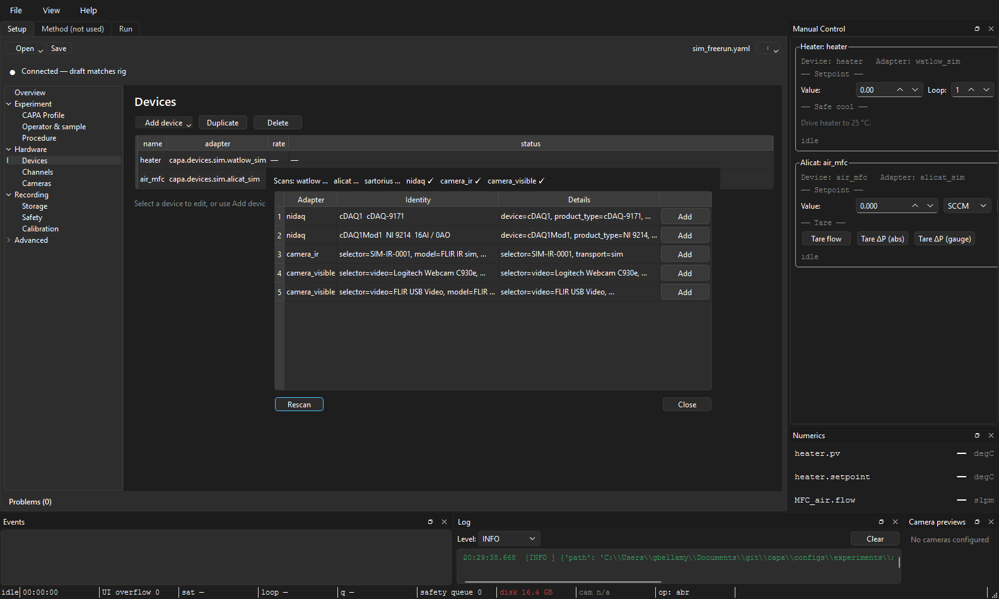
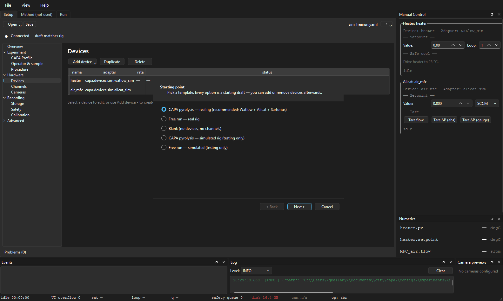

# The Setup tab

**Audience:** operators and config authors.
**Scope:** every panel of the Setup tab — outline, problems, sections,
connection strip, and the four dialogs (discovery, calibration plot,
calibration diff, apply-to-channels) that surface from it.

This is the largest surface in the app. Every other operator page
([the Run tab](the-run-tab.md), [manual controls](manual-controls.md),
[first real run](../getting-started/first-real-run.md)) links back to a
panel here — keep this page open in a second window while you read them.

---

## Anatomy

```
┌────────────────────────────────────────────────────────────────────────┐
│ [Open ▾]  [Save]   untitled / sim_freerun.yaml         [⋮ overflow]    │  ← toolbar
├────────────────────────────────────────────────────────────────────────┤
│ ●  Draft has 3 unsaved edit(s) — Apply & Connect to take effect.       │  ← connection strip
│                                                  [Revert] [Apply & Connect]
├──────────────┬─────────────────────────────────────────────────────────┤
│ Overview     │                                                         │
│ Experiment   │                                                         │
│  CAPA Profile│             Section editor                              │  ← main editor
│  Operator…   │             (whichever outline row is selected)         │     (scrolls)
│  Procedure   │                                                         │
│ ● Hardware   │                                                         │
│  ● Devices   │                                                         │
│   Channels   │                                                         │
│   Cameras    │                                                         │
│ Recording    │                                                         │
│  Storage     │                                                         │
│  Safety      │                                                         │
│  Calibration │                                                         │
│ Advanced     │                                                         │
│  Files       │                                                         │
├──────────────┴─────────────────────────────────────────────────────────┤
│ Problems (2)  ✗  channels[heater_pv] missing binding   → Channels      │  ← problems panel
│               ⚠  cameras[ir]: device id not found      → Cameras       │
└────────────────────────────────────────────────────────────────────────┘
```



Four regions, each documented below in the order you encounter them:

1. **Toolbar** — Open / Save / Save As / Validate / Scan / Verify / Revert.
2. **Connection strip** — the persistent rig-connectivity surface.
3. **Outline** (left) — section navigator with status markers.
4. **Section editor** (centre) — the field forms for the selected row.
5. **Problems panel** (bottom) — validation errors and warnings, with
   click-to-jump.

---

## Toolbar

| Button / menu item | What it does | Disabled when |
|---|---|---|
| **Open ▾ → New from template…** | Launch the [Setup wizard](#the-setup-wizard) for a greenfield config | a run is active |
| **Open ▾ → Open file…** | File picker for `*.yaml` / `*.toml` experiment files | a run is active |
| **Open ▾ → Recent** | Submenu of recently opened configs (capped at 10) | — |
| **Save** | Write the current draft back to its source path | source is untitled |
| **⋮ → Save As…** | Pick a new path; supports converting between inline and external method/hardware | — |
| **⋮ → Validate** | Run all four offline validation layers (no hardware touched) | — |
| **⋮ → Scan for devices** | Open the [Discovery dialog](#discovery-dialog) | a run is active |
| **⋮ → Verify connection** | Layer-5 live handshake against the hardware described in the draft | a run is active |
| **⋮ → Revert draft** | Discard unsaved edits and re-read from disk | draft is clean |

`Apply & Connect` does **not** live in the toolbar — it lives on the
[connection strip](#connection-strip) where the operator looks for "is
the rig live?". Putting it on both would split attention.

The source label between the primary actions and the overflow shows
either the file path or `untitled` — Save without a path goes through
**Save As** automatically.

---

## Connection strip

The strip lives directly under the toolbar and is always visible. It
answers exactly one question — *is the rig live, and if not, what should
I do next?* — with one coloured dot and one sentence.

### The seven states

The strip resolves to one of these from a snapshot of its inputs (draft
status, controller signals, in-flight flags). They're priority-ordered:
the first that matches wins.

| State | Glyph / colour | Message | When it shows |
|---|---|---|---|
| **FROZEN** | 🔒 purple | "Run in progress — config locked until the run completes." | A run is active. Edits and Apply are refused. |
| **CONNECTING** | ◐ blue | "Connecting — opening hardware…" | Apply & Connect is mid-flight. |
| **CHECKING** | ◐ indigo | "Verifying connection — read-only handshake in progress…" | Verify connection is mid-flight. |
| **FAILED** | ✗ red | "Last apply failed — *detail*." | The most recent Apply & Connect failed. Stays until you edit the draft or retry. |
| **CONNECTED** | ● green | "Connected — draft matches rig." | Hardware is ready, no unsaved edits. |
| **UNAPPLIED** | ◐ amber | "Draft has *N* unsaved edit(s) — Apply & Connect to take effect." | Hardware is ready (or no apply has succeeded yet), but the draft has diverged. |
| **IDLE** | ○ gray | "No config loaded" | App just opened. |

The strings above are literal — searchable across the docs. If you see
something different, the code has changed; the source of truth is
[`setup_connection_strip.py`](https://github.com/GraysonBellamy/capa/blob/main/src/capa/ui/tabs/setup_connection_strip.py).

The six most common surfaces, head-on:

**IDLE** — no config loaded yet:


**UNAPPLIED** — draft has unsaved edits:



**CONNECTING** — Apply & Connect is mid-flight:



**CONNECTED** — happy path:



**FAILED** — Apply threw; Details… surfaces the full error:



**FROZEN** — run in progress, config locked:


### Buttons on the strip

| Button | Visible in state | What it does |
|---|---|---|
| **Open config…** | IDLE | File picker; same as toolbar Open file. |
| **New setup** | IDLE | Launches the wizard. |
| **Details…** | FAILED | Modal with the full error from the last apply. |
| **Revert** | UNAPPLIED | Re-read the source file, discarding edits. |
| **Apply && Connect** | UNAPPLIED, FAILED | Compose draft → validate → open hardware → start background acquisition. **Disabled when the draft has validation errors** — fix them in the Problems panel first. |

Apply & Connect is the only path that opens hardware. Toolbar **Validate**
and **Verify connection** never open or close worker connections — they
only inspect.

---

## Outline

The left column lists every editable section in a fixed tree:

```
Overview
Experiment
  CAPA Profile
  Operator & sample
  Procedure
Hardware
  Devices
  Channels
  Cameras
Recording
  Storage
  Safety
  Calibration
Advanced
  Files
```

Each row carries up to two status markers, which can stack as `●⚠` or
`●✗`:

| Marker | Meaning |
|---|---|
| *(none)* | clean, validated |
| `●` | dirty — edits not yet saved to disk |
| `⚠` | warnings only |
| `✗` | at least one error |

Markers roll up: if **Channels** has an error, the **Hardware** parent
also shows `✗`. This means the operator can scan the outline once and
know which subtree to drill into.


The tree mirrors the operator's three questions — *what experiment,
what hardware, where does data go* — rather than the underlying Pydantic
shape. **Advanced → Files** is collapsed by default and holds the
inline-vs-external method/hardware-reference editor that most operators
never touch.

---

## Section editor

The centre pane shows the form for whichever outline row is selected.
Every section is scroll-wrapped so tall panes (CAPA Profile, Channels)
never spill off-screen on a 1080p display.

### Overview

Read-only glance — what's loaded, what's dirty, what to do next. The
"Edit" buttons on the Hardware glance jump to the matching child
section in the outline.

### Experiment → CAPA Profile

The cone-calorimeter scientific metadata: external flux, sample mass,
distance, atmosphere, holder. See
[CAPA profile fields](../configuration/capa-profile.md) for the per-field
reference. **This is the section to fill in for a real run** — most of it
is irrelevant for a simulator tour.

### Experiment → Operator & sample

Free-text fields: operator id (goes to the status bar's `op` pill), sample
id, notes. The operator id is stamped into every event the run records,
so changing it mid-day matters for the audit trail.

### Experiment → Procedure

Pick which procedure plugin drives the run — free run, recipe runner,
heat-flux tune, etc. See
[What is a procedure](../procedures/what-is-a-procedure.md). The choice
gates which other tabs are useful: a free-run procedure leaves the Method
tab empty; the recipe runner expects a method.

### Hardware → Devices

The device table. Add a Watlow, Alicat, NI-DAQ, Sartorius row; pick a
transport (`com_port=COM5`, `host=192.168.1.10`, etc.). The Discovery
dialog can populate this for you — see below.

Right-click → **Open manual control** jumps to the Manual tab with that
device's card surfaced. The Setup tab forwards this through the
`deviceActionRequested` signal.

### Hardware → Channels

The channel table — the bridge between "device A reports parameter P" and
"my data column is called `heater_pv`." Each channel row points at a
device + parameter + (optional) instance via a
[binding](../configuration/channel-bindings.md). The
[Apply-to-channels dialog](#apply-to-channels-dialog) is invoked from a
button on this section.

### Hardware → Cameras

Visible-light and IR cameras: the camera table (id, source kind,
resolution / fps / codec) plus the per-camera target channel for any
derived scalars (e.g. mean IR temperature).

### Recording → Storage

Storage policy fields: the bundle-root hint plus advanced IPC/Parquet
placeholders. Most operators leave this at the default — the
[workspace layout](../configuration/workspace-layout.md) page covers
re-rooting onto a fast drive.

### Recording → Safety

Per-channel alarm bands and the per-fault disposition (`warn` / `abort` /
`safe_shutdown`). The safety system reads this on every sample; getting
it wrong is a real-money mistake on a real rig.

### Recording → Calibration

Glance view of the currently-applied calibration set per channel —
read-only here. Edits happen on the **Channels** section's per-row
calibration popover, which opens the
[calibration plot](#calibration-plot-dialog).

### Advanced → Files

For configs split across files: pick which fields are inline in the
experiment YAML vs. referenced by `path = "..."`. Power-user only; the
wizard's output is always inline.

---

## Problems panel

The bottom strip lists every problem from the most recent validate. Each
row shows the severity glyph (`✗` error, `⚠` warning), a sentence, and a
clickable section name that jumps the outline to the offending row.



Validation runs automatically on every keystroke (200 ms debounce) and
covers four offline layers:

1. **Schema** — Pydantic parsing. Wrong types, missing required fields.
2. **Semantic** — cross-field rules (e.g. setpoint > 0, device id known).
3. **Hardcoded** — invariants that don't depend on user config.
4. **Known catalogue** — registered procedures, profiles, devices.

The fifth layer — **live handshake** with the hardware — runs **only**
when you click toolbar **Verify connection** or the connection strip's
**Apply & Connect**. The Problems panel never opens a serial port on its
own.

A draft with errors disables both Save (some configs) and Apply &
Connect — the buttons' tooltips point you back here.

---

## Dialogs

### Discovery dialog

Toolbar **⋮ → Scan for devices** opens a modal that scans the bus
families capa knows about (Watlow Modbus, Alicat serial, NI-DAQ
chassis, USB cameras). Pick the devices you want, map their roles
(*heater*, *mfc*, etc.), and apply — the dialog writes rows back into
the **Devices** section.



A rescan cancels any previous scan task before starting (anti-race), so
clicking the button twice quickly is safe.

Discovery is **disabled during runs** because it would have to open
serial buses the worker pool owns.

### Calibration plot dialog

From the **Channels** section, click the calibration column for a row to
open the plot. It shows the raw-vs-engineering curve for the channel's
binding, with the draft's calibration overlaid on the saved set so you
can see what a pending edit does. Drag a knot, paste a CSV table, or
import from a calibration set on disk.

### Calibration set diff dialog

If the draft's calibration differs from what's saved in the
[calibration set](../configuration/calibrations.md), the diff dialog
spells out which channels changed and by how much. Surfaces from the
calibration plot's "Save back to set…" flow and from Apply & Connect
when it detects a drift.

### Apply-to-channels dialog

Edits a binding-or-calibration value on one channel, then opens this
dialog to mass-apply the same value to every channel matching a filter
(same device, same parameter family, etc.). Useful when you're wiring
twelve thermocouples to the same NI-DAQ module with the same
calibration — set one, propagate to all.

### Save As dialog

Standard file picker plus a checkbox for "extract method/hardware to
external files" — converts an inline-everything config into the
file-per-piece layout that's easier to diff in git. Inverse conversion
is also offered when you Save As an external config to a new path.

### The Setup wizard

**Open ▾ → New from template…** launches a one-screen wizard that asks
the bare minimum for a runnable config: procedure, profile, primary
heater, primary MFC, sample id. The wizard-produced draft is marked
**unapplied** on completion so the **Apply & Connect** button lights up
immediately — the wizard's whole point is "open this and start running."



---

## How edits flow through the tab

The Setup tab owns a `SetupDraft`. Every section edit emits a patch that
the draft applies; the draft's bookkeeping decides which sections are
dirty and which rows in the Problems panel are still relevant.

When you click Apply & Connect:

1. The current draft is composed with the Method tab's in-memory method
   buffer (so a method-edit-then-Apply works without saving the method
   first).
2. The composed `ExperimentConfig` is re-validated end-to-end.
3. The tab emits `applyRequested(config, source_path)` to the main
   window.
4. The main window drives `RunController.set_active_config(...)`, which
   opens (or hot-reloads) the worker pool.
5. The connection strip flips CONNECTING → CONNECTED on success, or
   CONNECTING → FAILED on a thrown error.

See [daily workflow](../getting-started/daily-workflow.md) for
hot-vs-cold reload semantics during this step.

---

*See also:* [Configuration overview](../configuration/overview.md),
[Channel bindings](../configuration/channel-bindings.md),
[Validation and problems](../configuration/validation-and-problems.md),
[Status bar guide](status-bar-guide.md),
[Runtime architecture](../architecture/runtime-architecture.md).
